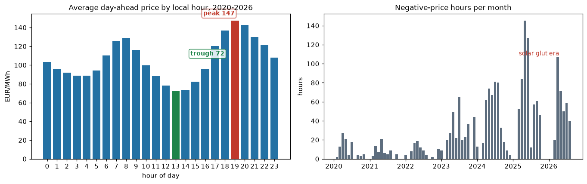
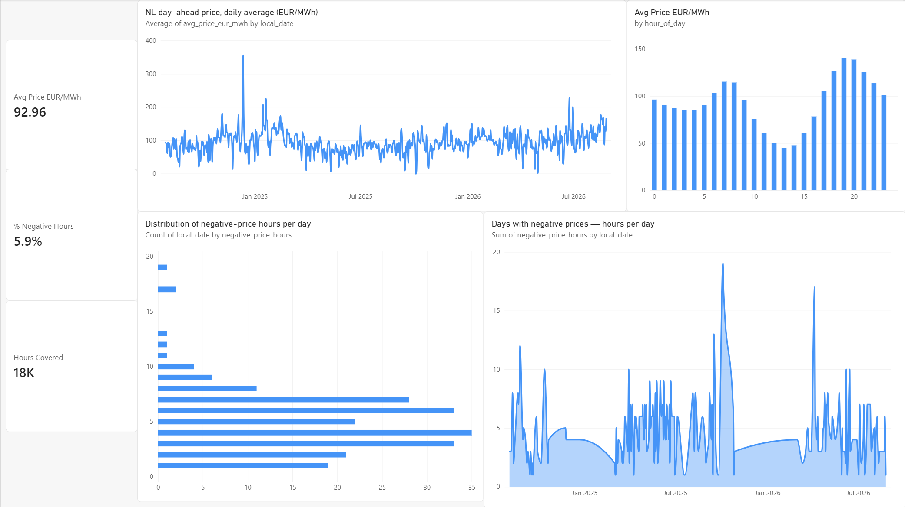
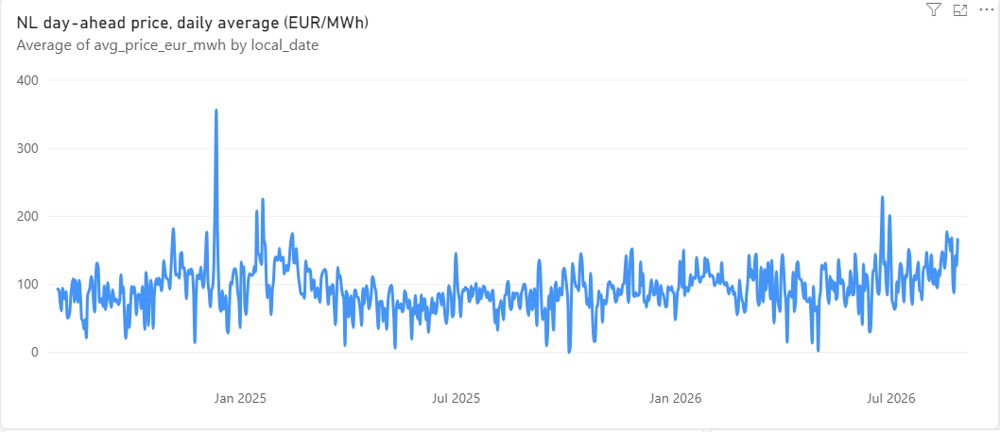
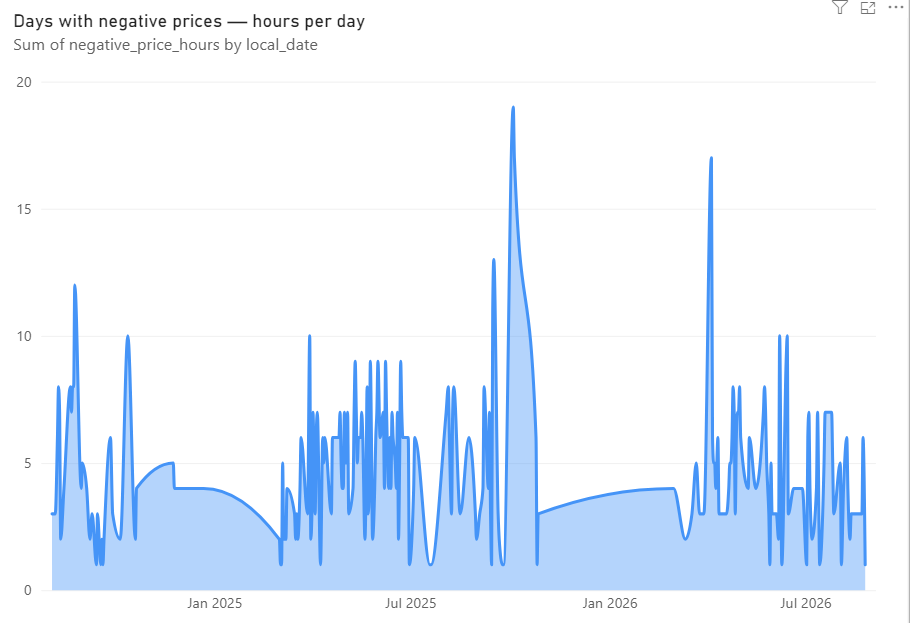
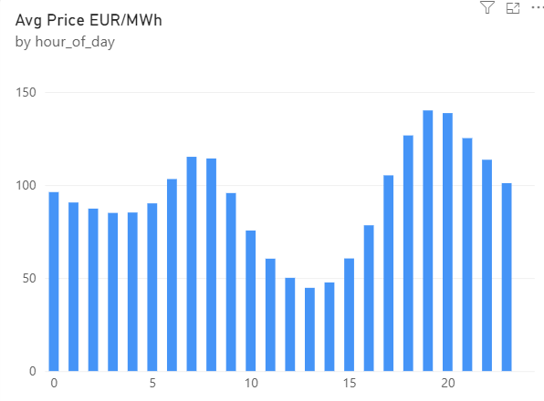

# nl-energy-warehouse

[](https://github.com/kaeldrin-gh/nl-energy-warehouse/actions/workflows/ci.yml)
[](https://github.com/kaeldrin-gh/nl-energy-warehouse/actions/workflows/docs.yml)

[](https://github.com/astral-sh/ruff)

A production-style data warehouse for Dutch electricity prices and weather, built to answer one question: **what actually drives the hourly power price in the Netherlands, and when is it cheap?**

Day-ahead prices from the [ENTSO-E Transparency Platform](https://transparency.entsoe.eu/), hourly weather from KNMI station data (currently served by a keyless [Open-Meteo](https://open-meteo.com/) ERA5 interim after KNMI retired its bulk downloads), cross-checked against [energy-charts.info](https://energy-charts.info/). Ingested idempotently with revision-aware upserts, modeled in dbt, tested in CI, and served as clean marts for BI.

> **New to data engineering?** [PROJECT_EXPLAINED.md](PROJECT_EXPLAINED.md) walks the entire project in plain language — every tool explained, no prior knowledge assumed.

## Why this repo exists

Public energy data is a great engineering stress test:

- **ENTSO-E revises published data retroactively.** The price you fetched yesterday may not be the price published today. Naive append-only ingestion silently corrupts history.
- **European timezones mean DST.** KNMI hourly data is labeled 1-24 in *local* time, which does not map 1:1 to UTC hours twice a year.
- **Two independent sources disagree** on the same price. By how much is acceptable? That needs a test, not a hope.

Each of these is handled explicitly and documented in [INCIDENTS.md](INCIDENTS.md) as a postmortem of the design decision it produced.

## The answer, in four numbers

Computed from this repo's own marts: **58,319 delivery hours** (Jan 2020 → Aug 2026), ENTSO-E primary with an energy-charts cross-check, Open-Meteo weather alongside. Full methodology and caveats in [analysis/findings.md](analysis/findings.md).

| | |
| --- | --- |
| **€147 vs €72** | evening peak vs midday trough — the duck curve, priced |
| **−46%** | what windy hours (≥ 6 m/s) cost on average versus calm ones |
| **97 → 584** | negative-price hours per year (2020 → 2025) — solar is rewriting the price floor |
| **22.5% vs 6.7%** | share of midday hours below zero on weekends versus weekdays |



One actionable conclusion: **a windy weekend midday is the cheapest segment of the Dutch electricity week**, running at roughly half the price of an average weekday evening.

Every number here is re-runnable in one command: `python -m ingest.cli bi headline` (or `v1`–`v5`) executes the SQL from `bi_queries.sql` against the warehouse — the README's figures are always one query away from being current.

## Architecture

```
ENTSO-E      (XML API)  ─┐
energy-charts (JSON)    ─┼─> ingest/ (Python, idempotent upserts) ─> DuckDB raw
Open-Meteo    (ERA5)    ─┘         (KNMI station ingester ready; its legacy
                                   endpoint was retired mid-project: INC-006)
                                                       │
                                                       v
                                   dbt: staging -> intermediate -> marts
                                                       │
                                       tests + CI (GitHub Actions)
                                                       │
                                   BI, report.html, analysis/findings.md
```

- **Ingestion**: watermark + fixed lookback window, so revisions inside the window overwrite stale values (`INSERT OR REPLACE` on natural keys). Chunked backfill mode with retry and exponential backoff. Every run is logged to `raw.ingest_log`.
- **Staging**: deduplication to latest revision, weather local-hour to UTC conversion with explicit DST semantics, and a unified weather feed that prefers KNMI station observations over the Open-Meteo reanalysis.
- **Marts**: `fct_hourly_price_weather` (one row per UTC hour, price + weather + cross-source diff, `price_source` / `weather_source` provenance flags) and `mart_daily_summary`, both incremental with a revision-matched reprocessing window. ENTSO-E is authoritative; energy-charts fills unpublished hours as a flagged fallback.
- **Tests**: uniqueness, sanity bounds set to exchange limits, cross-source price alignment, hour-continuity, provenance consistency, plus a native dbt unit test proving the fallback semantics with mocked inputs.

## What it looks like

Six and a half years of **real** Dutch day-ahead prices - ENTSO-E primary, energy-charts.info cross-check and gap-filler - flowing through the dbt marts to Parquet and Power BI. Every visual below is backed by a query block in [`analysis/bi_queries.sql`](analysis/bi_queries.sql); measures live in [`analysis/powerbi_measures.md`](analysis/powerbi_measures.md). The Power BI file itself is in the repo: [`powerbi/nl-energy-dashboard.pbix`](powerbi/nl-energy-dashboard.pbix).


*Full report page: headline stats, daily price development, hour-of-day profile, negative-price analysis.*

**Daily average price** — the December 2024 scarcity event pushes one day's average to ~€360/MWh (hourly extreme that day: €873) *(V1)*:



**Days with negative prices** — solar-glut clusters concentrate in spring and summer 2026, including days with up to ~19 sub-zero hours *(V3)*:



**Shape of an average day** — evening peak vs midday solar dip; the duck curve, straight from market data *(V2)*:



## Quickstart

```bash
pip install -e ".[dbt]"
python -m ingest.cli load --sample          # 90 days of seeded sample data, no API keys needed
dbt build --project-dir dbt --profiles-dir dbt
```

Already set up and just want fresh numbers? One command runs the whole chain — incremental live load → `dbt build` → Parquet export → report:

```bash
python -m ingest.cli refresh
python -m ingest.cli bi headline     # then ask it anything
```

To use real sources, copy `.env.example` to `.env`, add your free [ENTSO-E token](https://transparency.entsoe.eu/usrm/user/create) (KNMI key optional), then:

```bash
python -m ingest.cli load                                   # incremental: new window + 7-day revision lookback
python -m ingest.cli load --backfill --from 2024-01-01      # chunked historical load, retry with backoff
```

Live status: a scheduled cron keeps this repo fed from the live APIs. **ENTSO-E is the primary source**; energy-charts.info fills the ~1.5% of hours where ENTSO-E's publication is incomplete — a `price_source` column records who supplied every number in BI — and `assert_cross_source_alignment` holds the two publishers to a €2/MWh agreement wherever they overlap. Weather currently arrives from Open-Meteo's keyless ERA5 archive; live KNMI ingestion is offline because KNMI retired its legacy uurgeg downloads mid-project ([INC-006](INCIDENTS.md)).

The mart models are incremental (`delete+insert`) with a 7-day reprocessing window that matches the ingestion revision lookback, so a retroactive source correction propagates from raw to marts on the next run without a full refresh.

Everything runs locally on DuckDB. The same dbt project is also validated against PostgreSQL in CI (see the `validate-postgres` job) — plain SQL, two engines. A Snowflake profile stub is included; porting was designed for but not yet executed on Snowflake.

## Semantic layer

`dbt/models/semantics.yml` exposes the marts through the dbt Semantic Layer: an hourly semantic model over `fct_hourly_price_weather` with three metrics (`avg_day_ahead_price`, `negative_price_hours`, `total_radiation`). The definitions are parsed and validated on every CI run as part of `dbt build`. They are plain YAML and travel with the SQL to Snowflake unchanged, where metrics become queryable through the hosted dbt Semantic Layer and its BI integrations.

> Local metric queries via the `mf` CLI (dbt-metricflow) currently pin to dbt-core ~1.8-era adapters; against dbt 1.12 the CLI crashes inside adapter connection handling (the definitions themselves parse and validate cleanly). When dbt-metricflow catches up, `mf query --metrics avg_day_ahead_price --group-by metric_time` works against this repo out of the box.

## CI/CD

Three GitHub Actions workflows live in `.github/workflows/`:

- **ci** — three jobs: ruff lint, the full pytest suite (including the DST integration tests that run complete dbt builds) plus a sample-data `dbt build` and source-freshness check, and `validate-postgres`: the identical dbt project built against PostgreSQL 17 in a service container. Runs on every push and PR.
- **docs** — regenerates the dbt documentation site from seeded sample data and deploys it to **GitHub Pages**: [kaeldrin-gh.github.io/nl-energy-warehouse](https://kaeldrin-gh.github.io/nl-energy-warehouse/) — a live, generated data catalog with lineage, column docs and test coverage.
- **ingest** — daily cron running the incremental live ingest → `dbt build` → Parquet export, uploaded as workflow artifacts. Skips gracefully when the `ENTSOE_TOKEN` secret is absent, so forks stay green without credentials.

Local pre-commit hooks (`ruff --fix`, `ruff-format`) mirror the CI lint job: `pre-commit install`.

## When something breaks

| Symptom | Where to look | Background |
| --- | --- | --- |
| CI red on `ci` workflow | Actions log → failing step (lint / pytest / dbt build / source freshness) | test scope in [Testing](#testing) |
| Scheduled ingest yellow or failed | `ingest` workflow log → which source line | rate limits: INC-007, retired endpoints: INC-006, upstream 503: INC-009 |
| Cross-source alignment test fails | `dbt\tests\assert_cross_source_alignment.sql` output rows | INC-001, INC-003, INC-007 |
| Prices look wrong for one hour | `raw.ingest_log` + `exports/report.html` pipeline-health table | INC-004, INC-007 |
| Source freshness fails | `dbt source freshness` output: which table is stale | INC-006 (KNMI offline) |

Data-quality philosophy: guardrails reject what is *provably* broken (uniqueness, technical price limits, alignment); anomalies within legal bounds surface as report sections and provenance flags, not failed builds.

## Reproducibility

`requirements-lock.txt` pins the exact dependency set the CI suite runs against
(`pip install -r requirements-lock.txt`). The Docker image wraps ingest + dbt:

```bash
docker build -t nl-energy-warehouse .
docker run -v "$PWD/warehouse:/data" nl-energy-warehouse                 # sample load
docker run --entrypoint dbt -v "$PWD/warehouse:/data" nl-energy-warehouse \
    build --project-dir dbt --profiles-dir dbt                           # full pipeline on sample data
```

## Testing

```bash
pip install -e ".[dbt,test]"
python -m pytest tests -v
```

- **Parser tests** against committed ENTSO-E XML and KNMI uurgeg fixtures (hourly and 15-minute resolutions, negative prices, missing values, hour-24 labels) — no network needed
- **Ingestion tests**: upsert idempotency (load twice, same row count) and revision overwrite (newer `fetched_at` wins)
- **Determinism tests**: the sample generator produces byte-identical data for the same seed
- **DST integration tests**: a full dbt build runs against synthetic spring (missing local hour) and autumn (overlapping label) transition days, asserting staging produces no duplicate hours

## What this demonstrates

- Idempotent, revision-aware ingestion against a source that rewrites history
- Timezone and DST handling as an explicit, tested modeling decision
- Cross-source reconciliation with an automated alignment test
- Source failover with provenance tracking when the authoritative source is unavailable
- One dbt project, two engines: validated against DuckDB and PostgreSQL on every push
- dbt layering (staging / intermediate / marts) with tests wired into CI
- dbt Semantic Layer metric definitions (YAML) over the fact mart, validated on every build
- Deterministic sample mode so the whole pipeline runs without credentials
- An analysis answer ([analysis/findings.md](analysis/findings.md)) with every number computed from the marts — insight, not just plumbing

## Roadmap

- [x] Incremental mart models with a revision-matched reprocessing window
- [x] dbt semantic layer metric definitions, validated in CI
- [x] Scheduled ingest workflow, docs site on GitHub Pages, pre-commit lint
- [x] Dependency lockfile and Docker image
- [x] Power BI dashboard screenshots in README (measure pack in `analysis/`)
- [ ] KNMI Data Platform migration for live weather ingestion ([INC-006](INCIDENTS.md))
- [ ] ENTSO-E generation mix and cross-border flows
- [ ] Cheap-hour notification service
