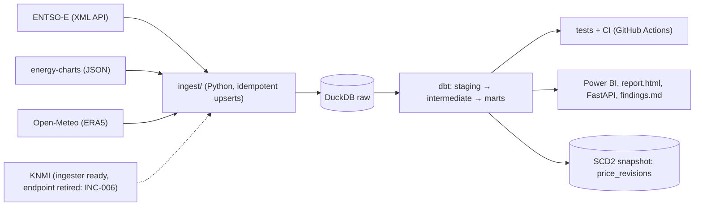

# nl-energy-warehouse

[](https://github.com/kaeldrin-gh/nl-energy-warehouse/actions/workflows/ci.yml)
[](https://github.com/kaeldrin-gh/nl-energy-warehouse/actions/workflows/docs.yml)
[](LICENSE)

**[Live market report](https://kaeldrin-gh.github.io/nl-energy-warehouse/report.html)** — price metrics, charts and news topics, rebuilt daily · **[dbt data catalog](https://kaeldrin-gh.github.io/nl-energy-warehouse/)** — lineage, column docs and test coverage

A data warehouse for Dutch electricity prices and weather, built to answer one
question: what drives the hourly power price in the Netherlands, and when is it
cheap?

**Stack:** Python · dbt · DuckDB · PostgreSQL · Docker · GitHub Actions · Power BI

Day-ahead prices come from the [ENTSO-E Transparency Platform](https://transparency.entsoe.eu/),
weather from KNMI station data ([Open-Meteo](https://open-meteo.com/) ERA5 covers
the gap while KNMI migrates), cross-checked against [energy-charts.info](https://energy-charts.info/).
Ingestion is idempotent with revision-aware upserts, modeling is done in dbt, and
the marts are tested in CI and served for BI.

Streaming counterpart: [de-energy-streaming](https://github.com/kaeldrin-gh/de-energy-streaming)
covers the Kafka → Spark → Iceberg stack on German day-ahead prices.
Managed-platform counterpart: [databricks-energy-quality](https://github.com/kaeldrin-gh/databricks-energy-quality)
covers data-quality monitoring on Databricks (Unity Catalog, Delta, Lakeflow
pipelines, Declarative Automation Bundles).

## Where to look first

| If you have | Read |
| --- | --- |
| 2 minutes | The four numbers below and the [live market report](https://kaeldrin-gh.github.io/nl-energy-warehouse/report.html) |
| 10 minutes | [int_price_weather_hourly.sql](dbt/models/intermediate/int_price_weather_hourly.sql) (source priority and provenance), the DST handling in [stg_knmi__hourly_weather.sql](dbt/models/staging/stg_knmi__hourly_weather.sql), and [tests/test_dst_staging.py](tests/test_dst_staging.py), which builds the project over both DST nights |
| A design discussion | [INCIDENTS.md](INCIDENTS.md): 10 postmortems, each ending in the design change it produced |
| The dbt side | The [data catalog](https://kaeldrin-gh.github.io/nl-energy-warehouse/) (lineage, column docs, tests) and the contracts in [_marts__models.yml](dbt/models/marts/_marts__models.yml) |

## Why this repo exists

Public energy data is a good engineering stress test:

- ENTSO-E revises published data retroactively, so the price fetched yesterday
  may not be the price published today, and append-only ingestion corrupts history.
- European timezones mean DST: KNMI hourly data is labelled 1-24 in local time,
  which does not map to UTC hours twice a year.
- Two independent sources disagree on the same price. How much disagreement is
  acceptable needs a test, not a hope.

Each is handled explicitly; [INCIDENTS.md](INCIDENTS.md) holds the postmortems
behind the design decisions.

## The answer in four numbers

Computed from the marts: 58,319 delivery hours (January 2020 to August 2026),
ENTSO-E primary with an energy-charts cross-check and Open-Meteo weather alongside.
Methodology and caveats: [analysis/findings.md](analysis/findings.md).

| Metric | Value |
| --- | --- |
| Evening peak vs midday trough | €147 vs €72 per MWh |
| Windy hours (≥ 6 m/s) vs calm | −46% average price |
| Negative-price hours per year | 97 (2020) → 584 (2025) |
| Midday hours below zero, weekends vs weekdays | 22.5% vs 6.7% |


The practical takeaway: a windy weekend midday is the cheapest window of the
Dutch electricity week, at roughly half the price of an average weekday evening.

Every number is re-runnable: `python -m ingest.cli bi headline` (or `v1`-`v5`)
runs the SQL in [`analysis/bi_queries.sql`](analysis/bi_queries.sql) against the
warehouse.

## What it looks like

Six and a half years of real prices flowing through the dbt marts into Power BI.
Every visual is backed by a query in [`analysis/bi_queries.sql`](analysis/bi_queries.sql),
with measures in [`analysis/powerbi_measures.md`](analysis/powerbi_measures.md)
and the report file in [`powerbi/nl-energy-dashboard.pbix`](powerbi/nl-energy-dashboard.pbix).


Every delivery hour from January 2020 to August 2026 in one picture. The dark
band is the 2022 gas crisis (a yearly average of €242/MWh). The blue cells are
the hours below zero: they cluster around midday from March to September and
multiply from 2023 on. The worst single day, 4 October 2025, had 19 of them.


This fingerprint and the day-shape chart under the headline table are generated
from the marts by [`analysis/make_readme_charts.py`](analysis/make_readme_charts.py)
(`--through 2026-08-26`, the findings window).

## Architecture


```mermaid
flowchart LR
    E["ENTSO-E (XML API)"] --> I["ingest/ (Python, idempotent upserts)"]
    C["energy-charts (JSON)"] --> I
    O["Open-Meteo (ERA5)"] --> I
    K["KNMI (ingester ready, endpoint retired: INC-006)"] -.-> I
    I --> R[("DuckDB raw")]
    R --> D["dbt: staging → intermediate → marts"]
    D --> T["tests + CI (GitHub Actions)"]
    D --> BI["Power BI, report.html, FastAPI, findings.md"]
    D --> SN[("SCD2 snapshot: price_revisions")]
```

- Ingestion: watermark plus a fixed lookback window, so revisions inside the
  window overwrite stale values (`INSERT OR REPLACE` on natural keys). Backfills
  run in chunks with retry and backoff, and every run is logged to `raw.ingest_log`.
- Staging: deduplication to the latest revision, weather local-hour to UTC
  conversion with explicit DST semantics, and a unified weather feed that prefers
  KNMI observations over the Open-Meteo reanalysis.
- Marts: `fct_hourly_price_weather` (one row per UTC hour with price, weather,
  cross-source diff and provenance flags) and `mart_daily_summary`, both
  incremental with a revision-matched reprocessing window. ENTSO-E is
  authoritative; energy-charts fills unpublished hours as a flagged fallback.
- Date dimension: `dim_date` has one row per date (2020-2035) with ISO week,
  weekday and `hours_in_day` (23 or 25 on DST change days), for BI tools to use
  as their date table. Tests check one short and one long day per year, and
  that no mart day holds more hours than the calendar allows.
- History: `snapshots/price_revisions.sql` snapshots the deduplicated staging
  view into an SCD2 table (`dbt_valid_from`/`dbt_valid_to`), so every upstream
  revision of a delivery hour stays queryable. History starts at the first
  snapshot run; the raw table itself keeps only the newest revision per hour.

## News context (optional)

`python -m ingest.cli news` classifies public Dutch energy-news headlines (Solar
Magazine, Energiepodium, Duurzaam Nieuws, WindpowerNL) into nine energy topics
through the free [classifier.dev](https://classifier.dev) API. They land in
`raw.news_headlines` and show up as topic counts in the report and run summary.
The enrichment fails soft: a broken feed is skipped, a classifier outage leaves
the headline unclassified until the next run, and the price pipeline never
depends on it.

## Quickstart

```bash
pip install -e ".[dbt]"
python -m ingest.cli load --sample          # 90 days of seeded data, no API keys
dbt build --project-dir dbt --profiles-dir dbt
```

Refresh everything end to end (incremental load, dbt build, Parquet export,
report):

```bash
python -m ingest.cli refresh
python -m ingest.cli bi headline
```

For live sources, copy `.env.example` to `.env`, add a free
[ENTSO-E token](https://transparency.entsoe.eu/usrm/user/create) (KNMI key
optional), then:

```bash
python -m ingest.cli load                                   # incremental + 7-day revision lookback
python -m ingest.cli load --backfill --from 2024-01-01      # chunked historical load
python -m ingest.cli news                                   # optional: news headlines with topics
```

In the scheduled run, energy-charts fills the ~1.5% of hours ENTSO-E has not
published yet, and `assert_cross_source_alignment` holds the two publishers to
€2/MWh wherever they overlap.

## Semantic layer

`dbt/models/semantics.yml` defines three metrics over the hourly mart
(`avg_day_ahead_price`, `negative_price_hours`, `total_radiation`), built on
every CI run against both engines. [docs/metrics.md](docs/metrics.md) says what
each one means, how it is computed and who consumes it.

## API (read-only)

`api/main.py` serves the marts over HTTP for tools that should not open DuckDB
directly:

```bash
pip install -e ".[api]"
uvicorn api.main:app --reload          # interactive docs at /docs
curl "localhost:8000/prices/daily?limit=3"
```

| Endpoint | Returns |
| --- | --- |
| `GET /health` | 200 when the warehouse file exists, 503 otherwise |
| `GET /prices/daily?start=&end=&limit=` | daily aggregates from `mart_daily_summary`, newest first |
| `GET /prices/hourly?date=YYYY-MM-DD` | every hour of one local date from `fct_hourly_price_weather` |

The service resolves the warehouse like the rest of the repo (`DUCKDB_PATH`,
default `warehouse/energy.duckdb`), opens it read-only, never writes, and its
endpoints are covered by `tests/test_api.py`.

## CI/CD

Three workflows in `.github/workflows/`:

- **ci**: ruff, pytest (including DST builds), a sample-data `dbt build` with
  source freshness, the same sample load and build inside the Docker image,
  and the same project on PostgreSQL 17. The two marts and
  `dim_date` are contract-enforced, so a breaking column or type change fails
  every build.
- **docs**: publishes the dbt catalog and, daily, the live market report to
  [GitHub Pages](https://kaeldrin-gh.github.io/nl-energy-warehouse/).
- **ingest**: daily load, `dbt build` and Parquet export, with a metrics table
  on the run page. It refetches and retries once if only the alignment test
  fails (INC-010), skips cleanly without the `ENTSOE_TOKEN` secret so forks stay
  green, and opens one GitHub issue when a run fails.

Pre-commit hooks mirror the lint job: `pre-commit install`.

## When something breaks

| Symptom | Where to look | Background |
| --- | --- | --- |
| CI red | Actions log, failing step | Testing section below |
| Scheduled ingest failed | `ingest` workflow log | INC-007 (rate limits), INC-006 (retired endpoint), INC-009 (upstream 503) |
| Cross-source alignment fails | `dbt/tests/assert_cross_source_alignment.sql` output | Refetched and retried once automatically (INC-010); still red = INC-001, INC-003, INC-007 |
| One hour looks wrong | `raw.ingest_log`, pipeline health in `exports/report.html` | INC-004, INC-007 |
| Source freshness fails | `dbt source freshness` output | INC-006 (KNMI offline) |

Guardrails reject what is provably broken (uniqueness, exchange limits,
alignment); anomalies within legal bounds surface in the report and provenance
flags rather than failed builds.

## Reproducibility and tests

`requirements-lock.txt` pins the dependency set CI runs against. The Docker image
wraps ingest and dbt; CI runs these exact commands on every push:

```bash
docker build -t nl-energy-warehouse .
docker run -v "$PWD/warehouse:/data" nl-energy-warehouse                 # sample load
docker run --entrypoint dbt -v "$PWD/warehouse:/data" nl-energy-warehouse \
    build --project-dir dbt --profiles-dir dbt
```

```bash
pip install -e ".[dbt,test]"
python -m pytest tests -v
```

- Parser tests against committed ENTSO-E XML and KNMI fixtures (hourly and
  15-minute resolutions, negative prices, missing values, hour-24 labels)
- Ingestion tests: upsert idempotency and revision overwrite
- Determinism tests: the sample generator is byte-identical for a given seed
- DST integration tests: full dbt builds over synthetic spring and autumn
  transition days, asserting no duplicate hours
- API tests: the read-only FastAPI endpoints (health, ordering, date filters,
  validation) are exercised against the built sample warehouse

## License

MIT, see [LICENSE](LICENSE).
