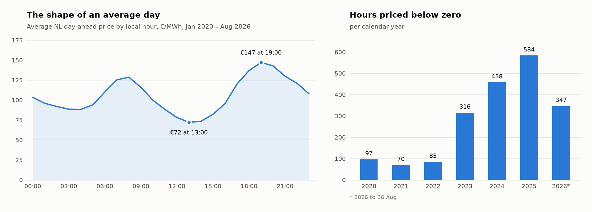
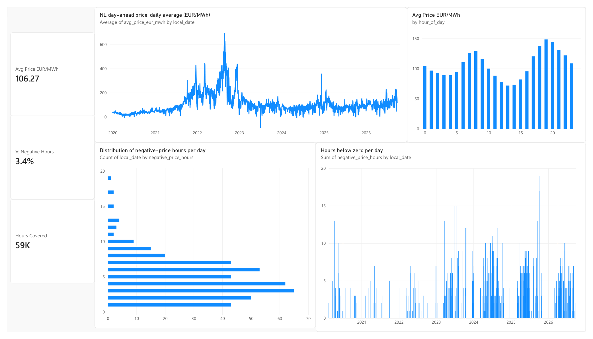
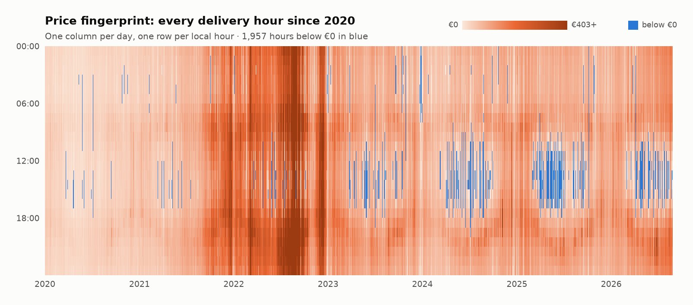
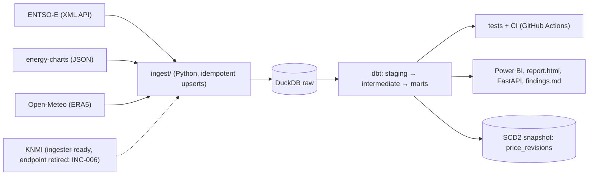

# nl-energy-warehouse

[](https://github.com/kaeldrin-gh/nl-energy-warehouse/actions/workflows/ci.yml)
[](https://github.com/kaeldrin-gh/nl-energy-warehouse/actions/workflows/docs.yml)
[](LICENSE)

**[Live market report](https://kaeldrin-gh.github.io/nl-energy-warehouse/report.html)** — price metrics, charts and news topics, rebuilt daily · **[dbt data catalog](https://kaeldrin-gh.github.io/nl-energy-warehouse/)** — lineage, column docs and test coverage

This project is a data warehouse for Dutch electricity prices and weather. It
answers one question: what changes the hourly power price in the Netherlands,
and when is it low?

**Stack:** Python · dbt · DuckDB · PostgreSQL · Docker · GitHub Actions · Power BI

The day-ahead prices come from the [ENTSO-E Transparency Platform](https://transparency.entsoe.eu/).
The weather comes from KNMI station data. While KNMI moves to a new platform,
[Open-Meteo](https://open-meteo.com/) ERA5 data fills the gap.
[energy-charts.info](https://energy-charts.info/) gives a second price source
for a cross-check.

The ingestion is idempotent and uses revision-aware upserts. dbt makes the
models. CI tests the marts, and BI tools read them.

Streaming counterpart: [de-energy-streaming](https://github.com/kaeldrin-gh/de-energy-streaming)
covers the Kafka → Spark → Iceberg stack on German day-ahead prices.
Managed-platform counterpart: [databricks-energy-quality](https://github.com/kaeldrin-gh/databricks-energy-quality)
covers data-quality monitoring on Databricks (Unity Catalog, Delta, Lakeflow
pipelines, Declarative Automation Bundles).

## Where to look first

| If you have | Read |
| --- | --- |
| 2 minutes | The four numbers below and the [live market report](https://kaeldrin-gh.github.io/nl-energy-warehouse/report.html) |
| 10 minutes | [int_price_weather_hourly.sql](dbt/models/intermediate/int_price_weather_hourly.sql) (source priority and provenance), the DST handling in [stg_knmi__hourly_weather.sql](dbt/models/staging/stg_knmi__hourly_weather.sql), and [tests/test_dst_staging.py](tests/test_dst_staging.py), which builds the project over both DST nights |
| A design discussion | [INCIDENTS.md](INCIDENTS.md): 11 postmortems, each ending in the design change it produced |
| The dbt side | The [data catalog](https://kaeldrin-gh.github.io/nl-energy-warehouse/) (lineage, column docs, tests) and the contracts in [_marts__models.yml](dbt/models/marts/_marts__models.yml) |

## Why this repo exists

Public energy data is a good engineering stress test:

- ENTSO-E changes data after it publishes it. Thus, the price from yesterday
  can be different from the price today. Append-only ingestion makes the
  history incorrect.
- European time zones use DST. KNMI labels its hourly data 1-24 in local time.
  Two times each year, these labels do not agree with UTC hours.
- Two independent sources can give different values for the same price. A test
  must set the permitted difference.

The project handles each problem explicitly. [INCIDENTS.md](INCIDENTS.md)
contains the postmortems that caused the design decisions.

## The answer in four numbers

Computed from the marts: 58,319 delivery hours (January 2020 to August 2026),
ENTSO-E primary with an energy-charts cross-check and Open-Meteo weather alongside.
Methodology and caveats: [analysis/findings.md](analysis/findings.md).

| Metric | Value |
| --- | --- |
| Evening peak vs midday trough | €147 vs €72 per MWh |
| Windy hours (≥ 6 m/s) vs calm | −46% average price |
| Negative-price hours per year | 97 (2020) → 584 (2025) |
| Midday hours below zero, weekends vs weekdays | 22.5% vs 6.7% |



The practical takeaway: a windy weekend midday is the cheapest window of the
Dutch electricity week, at roughly half the price of an average weekday evening.

Every number is re-runnable: `python -m ingest.cli bi headline` (or `v1`-`v5`)
runs the SQL in [`analysis/bi_queries.sql`](analysis/bi_queries.sql) against the
warehouse.

## What it looks like

Six and a half years of real prices flowing through the dbt marts into Power BI.
Every visual is backed by a query in [`analysis/bi_queries.sql`](analysis/bi_queries.sql),
with measures in [`analysis/powerbi_measures.md`](analysis/powerbi_measures.md)
and the report file in [`powerbi/nl-energy-dashboard.pbix`](powerbi/nl-energy-dashboard.pbix).



Every delivery hour from January 2020 to August 2026 in one picture. The dark
band is the 2022 gas crisis (a yearly average of €242/MWh). The blue cells are
the hours below zero: they cluster around midday from March to September and
multiply from 2023 on. The worst single day, 4 October 2025, had 19 of them.



This fingerprint and the day-shape chart under the headline table are generated
from the marts by [`analysis/make_readme_charts.py`](analysis/make_readme_charts.py)
(`--through 2026-08-26`, the findings window).

## Architecture


```mermaid
flowchart LR
    E["ENTSO-E (XML API)"] --> I["ingest/ (Python, idempotent upserts)"]
    C["energy-charts (JSON)"] --> I
    O["Open-Meteo (ERA5)"] --> I
    K["KNMI (ingester ready, endpoint retired: INC-006)"] -.-> I
    I --> R[("DuckDB raw")]
    R --> D["dbt: staging → intermediate → marts"]
    D --> T["tests + CI (GitHub Actions)"]
    D --> BI["Power BI, report.html, FastAPI, findings.md"]
    D --> SN[("SCD2 snapshot: price_revisions")]
```

- **Ingestion** uses a watermark and a fixed lookback window. A revision in
  this window replaces the old value (`INSERT OR REPLACE` on natural keys).
  Backfills run in chunks, with retry and backoff. Each run writes a row to
  `raw.ingest_log`.
- **Staging** keeps only the latest revision of each row. It changes the local
  weather hours to UTC, with explicit DST rules. It also makes one weather
  feed. This feed uses the KNMI observations first and the Open-Meteo
  reanalysis second.
- **Marts:**
  - `fct_hourly_price_weather` has one row for each UTC hour. Each row has the
    price, the weather, the difference between the two price sources and the
    provenance flags.
  - `mart_daily_summary` has the daily values.

  Both marts are incremental. They process again the same window as the
  revision lookback. ENTSO-E is the primary source. If ENTSO-E did not publish
  an hour, energy-charts fills it, and a flag shows this.
- **Date dimension:** `dim_date` has one row for each date from 2020 to 2035.
  It has the ISO week, the weekday and `hours_in_day` (23 or 25 on DST change
  days). BI tools can use it as their date table. Tests check that each year
  has one short day and one long day. They also check that no mart day has
  more hours than the calendar permits.
- **History:** `snapshots/price_revisions.sql` copies the deduplicated staging
  view into an SCD2 table (`dbt_valid_from`/`dbt_valid_to`). Thus, you can
  query each upstream revision of a delivery hour. The history starts at the
  first snapshot run. The raw table keeps only the newest revision of each
  hour.

## News context (optional)

`python -m ingest.cli news` gets public Dutch energy-news headlines from Solar
Magazine, Energiepodium, Duurzaam Nieuws and WindpowerNL. The free
[classifier.dev](https://classifier.dev) API gives each headline one of nine
energy topics. The headlines go into `raw.news_headlines`. The report and the
run summary show the number of headlines for each topic.

A failure in this step does not stop the price pipeline:

- If a feed is broken, the step skips it.
- If the classifier is not available, the headline stays without a topic until
  the next run.
- The price pipeline does not use the headlines.

## Quickstart

```bash
pip install -e ".[dbt]"
python -m ingest.cli load --sample          # 90 days of seeded data, no API keys
dbt build --project-dir dbt --profiles-dir dbt
```

To update all parts from start to end (incremental load, dbt build, Parquet
export and report), run:

```bash
python -m ingest.cli refresh
python -m ingest.cli bi headline
```

To use the live sources:

1. Copy `.env.example` to `.env`.
2. Add a free [ENTSO-E token](https://transparency.entsoe.eu/usrm/user/create).
   A KNMI key is optional.
3. Run these commands:

```bash
python -m ingest.cli load                                   # incremental + 7-day revision lookback
python -m ingest.cli load --backfill --from 2024-01-01      # chunked historical load
python -m ingest.cli news                                   # optional: news headlines with topics
```

In the scheduled run, energy-charts fills the approximately 1.5% of hours that
ENTSO-E did not publish yet. Where both sources have an hour,
`assert_cross_source_alignment` makes sure that they agree within €2/MWh.

## Semantic layer

`dbt/models/semantics.yml` defines three metrics on the hourly mart:
`avg_day_ahead_price`, `negative_price_hours` and `total_radiation`. Each CI run
builds them on both engines. [docs/metrics.md](docs/metrics.md) tells what each
metric means, how the warehouse calculates it and which tools use it.

## API (read-only)

`api/main.py` gives the marts over HTTP. Use it for tools that must not open
DuckDB directly:

```bash
pip install -e ".[api]"
uvicorn api.main:app --reload          # interactive docs at /docs
curl "localhost:8000/prices/daily?limit=3"
```

| Endpoint | Returns |
| --- | --- |
| `GET /health` | 200 when the warehouse file exists, 503 otherwise |
| `GET /prices/daily?start=&end=&limit=` | daily aggregates from `mart_daily_summary`, newest first |
| `GET /prices/hourly?date=YYYY-MM-DD` | every hour of one local date from `fct_hourly_price_weather` |

The service finds the warehouse in the same way as the rest of the repository
(`DUCKDB_PATH`, default `warehouse/energy.duckdb`). It opens the warehouse
read-only and never writes to it. `tests/test_api.py` tests all endpoints.

## CI/CD

Three workflows in `.github/workflows/`:

- **ci** runs these checks:
  - ruff and pytest, with the DST builds
  - a `dbt build` on sample data, with source freshness
  - the same sample load and build in the Docker image
  - the same project on PostgreSQL 17

  The two marts and `dim_date` have enforced contracts. Thus, a column or type
  change that breaks a consumer makes each build fail.
- **docs** publishes the dbt catalog to
  [GitHub Pages](https://kaeldrin-gh.github.io/nl-energy-warehouse/). Each day,
  it also publishes the live market report there.
  - If only energy-charts fails, docs publishes the report with a "Missing
    data" warning (INC-011).
  - If ENTSO-E fails or the build fails, docs deploys nothing. Pages keeps the
    last good report.
- **ingest** runs the daily load, `dbt build` and the Parquet export. It shows
  a metrics table on the run page.
  - If only the alignment test fails, it gets the data again and tries one
    more time (INC-010).
  - If the `ENTSOE_TOKEN` secret is not set, it stops without an error. Thus,
    forks stay green.
  - If a run fails, it opens a GitHub issue.

The pre-commit hooks do the same checks as the lint job. To install them, run
`pre-commit install`.

## When something breaks

| Symptom | Where to look | Background |
| --- | --- | --- |
| CI red | Actions log, failing step | Testing section below |
| Scheduled ingest failed | `ingest` workflow log | INC-007 (rate limits), INC-006 (retired endpoint), INC-009 (upstream 503) |
| Cross-source alignment fails | `dbt/tests/assert_cross_source_alignment.sql` output | The workflow gets the data again and tries one more time (INC-010). If it still fails, refer to INC-001, INC-003 and INC-007 |
| One hour looks wrong | `raw.ingest_log`, pipeline health in `exports/report.html` | INC-004, INC-007 |
| Source freshness fails | `dbt source freshness` output | INC-006 (KNMI offline) |
| The report shows "Missing data" | The warning on the report and on the run summary | energy-charts was not available, so the hours that ENTSO-E did not publish yet stay empty. The marts use the hours that are available. The next successful load fills the gaps (INC-011) |

The guardrails stop data that is definitely incorrect: duplicate keys, prices
outside the exchange limits, and sources that do not agree. Unusual values
inside the legal limits do not stop the build. The report and the provenance
flags show them.

## Reproducibility and tests

`requirements-lock.txt` sets the exact dependency versions that CI uses. The
Docker image contains the ingest code and dbt. For each push, CI runs these
commands:

```bash
docker build -t nl-energy-warehouse .
docker run -v "$PWD/warehouse:/data" nl-energy-warehouse                 # sample load
docker run --entrypoint dbt -v "$PWD/warehouse:/data" nl-energy-warehouse \
    build --project-dir dbt --profiles-dir dbt
```

```bash
pip install -e ".[dbt,test]"
python -m pytest tests -v
```

- **Parser tests** use committed ENTSO-E XML and KNMI fixtures. They include
  hourly and 15-minute resolutions, negative prices, missing values and
  hour-24 labels.
- **Ingestion tests** check that upserts are idempotent and that a revision
  replaces the old value.
- **Determinism tests** check that the sample generator gives the same bytes
  for the same seed.
- **DST integration tests** run full dbt builds on synthetic spring and autumn
  change days. They make sure that no hour occurs two times.
- **API tests** call the read-only FastAPI endpoints on the sample warehouse.
  They test the health check, the order of rows, the date filters and the
  validation.

## License

MIT, see [LICENSE](LICENSE).
